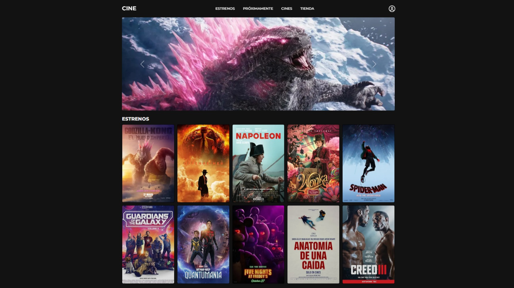
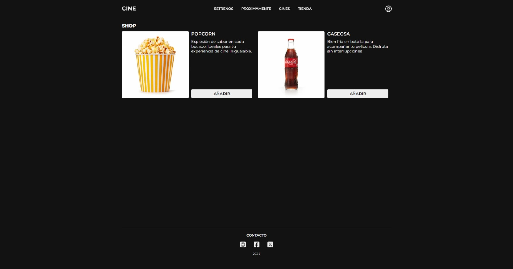
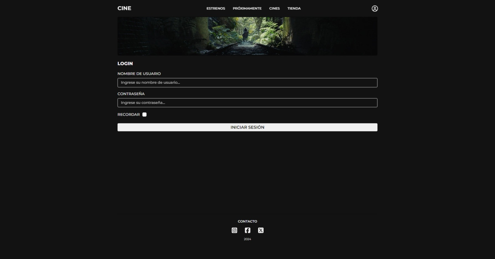

# Trabajo Práctico Obligatorio - Front - Codo A Codo 2024

Esta es una pagina web de un cine realizada por estudiantes de CODO a CODO para el curso de Programación FULLSTACK - PYTHON 2024.

Es una pagina sencilla que cuenta con diferentes secciones para: Estrenos, Proximamente, Cines, Tienda, Usuario y Redes Sociales.

## Link

El link del demo:

https://mathxlat.github.io/tpo-front-cac-2024/

## Capturas

Inicio

Tienda

Usuario

## PaletaColores

| Color             | Hex                                                                |
| ----------------- | ------------------------------------------------------------------ |
| Primary color |  #efefef |
| Secondary color |  #121212 |

## Authors

- [@mathxlat](https://github.com/mathxlat)
Mathías Latrónico

- [@manusan101](https://github.com/manusan101)
Manuel Sanchez

- [@LoreCapuano](https://github.com/LoreCapuano)
Lorena Capuano

- [@paulaavilla](https://github.com/paulaavilla)
Paula Villagra

